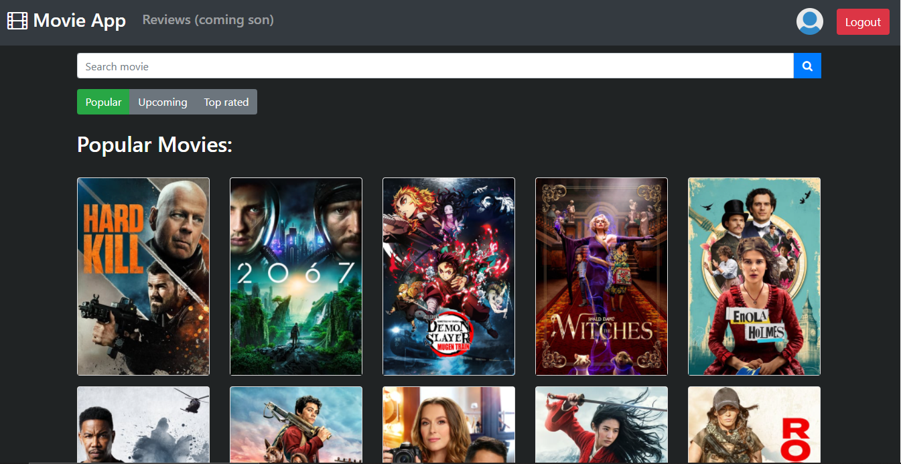
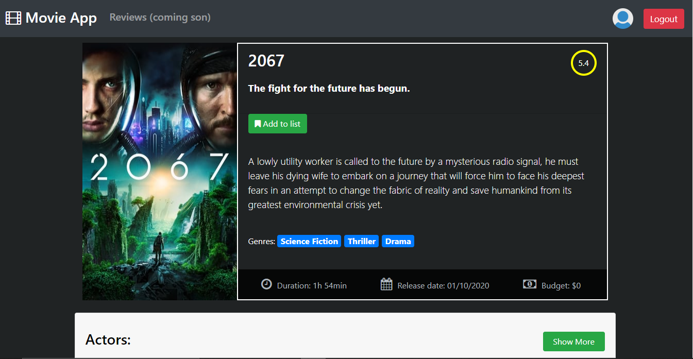

# Movie Browser

https://movie-app-rweb.herokuapp.com/

A React movie browser app

## About The Project

Movie browser is a simple app made by me in order to practice practicing some basic concepts of react de react. This is not a "final" version, as I intend to constantly be implementing new features in the app.

# Contributing

If you want to contribute to the project, follow the steps below:

1. Fork the Project
2. Run (`npm install`)
3. Create your Feature Branch (`git checkout -b feature/<yourFeatureName>`)
4. Commit your Changes (`git commit -m 'Add some <yourFeatureName>'`)
5. Push to the Branch (`git push origin feature/<yourFeatureName>`)
6. Open a Pull Request

## Contact

Willames Jr. - willamesj11@gmail.com